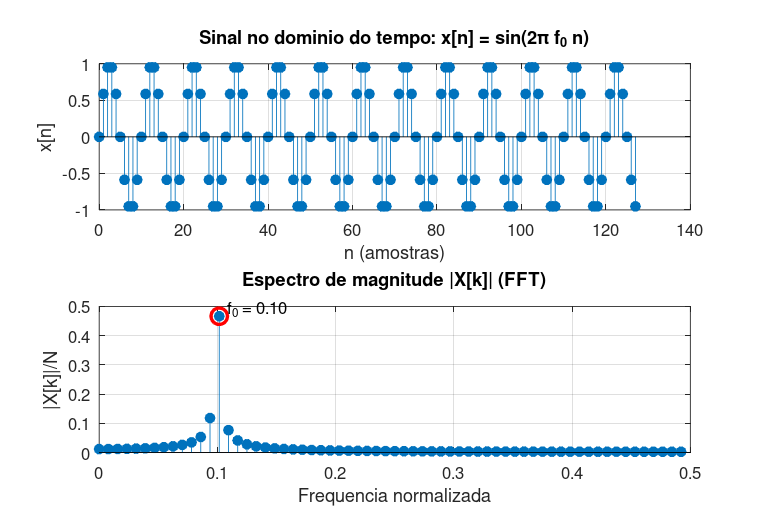

# Atividade 1 — Senoide Discreta no Espectro

**Pergunta investigada:** uma senoide com frequência normalizada *f₀ = 0,1* e *N = 128* amostras é gerada, plotada no tempo e transformada via FFT. Onde aparece a frequência dominante no espectro? A magnitude bate com o valor teórico?

---

## Setup do experimento

- Frequência normalizada: **f₀ = 0,1** ciclo/amostra (equivalente a *ω₀ = 0,2π rad/amostra*)
- Comprimento: **N = 128**
- Sem taxa de amostragem física definida — eixo espectral interpretado em frequência normalizada *[0; 0,5]*
- Sinal: *x[n] = sin(2π·f₀·n)*, *n = 0, …, 127*

## Roteiro do código

Script: [`atividade_1.m`](../Simulacoes/Octave/atividade_1.m).

O fluxo é direto: gera o vetor `x`, aplica `fft(x)`, normaliza a magnitude por `N`, recorta a metade informativa (0 a Nyquist) e localiza o bin de máximo com `max`.

## Saída da simulação

| Grandeza | Medido | Teórico |
|---|---|---|
| Posição do pico (bin *k*) | 13 | 12,8 (não inteiro) |
| Frequência detectada | 0,1016 | 0,1000 |
| Magnitude do pico | **0,4666** | *A/2 = 0,5* |
| Erro relativo em frequência | 1,6 % | — |

## O que o espectro revela

A energia da senoide aparece concentrada em torno do bin teórico *k = 12,8*. Como esse índice não é inteiro, o `max` da DFT pousa no bin vizinho mais próximo (*k = 13*, *f = 13/128 ≈ 0,1016*). A magnitude também fica um pouco abaixo do *A/2 = 0,5* esperado — porque parte da energia "vazou" para *k = 12* e para os bins adjacentes.

Esse fenômeno — pico que não cai exato em um bin → vazamento → magnitude reduzida — é o problema padrão de quem trabalha com FFT na vida real. A maneira de minimizá-lo é escolher *N* de forma que *f₀·N* seja inteiro, ou aplicar janelamento (assunto da Atividade 4).

## Lição prática

A FFT não devolve "a frequência exata" do sinal: ela amostra o espectro contínuo em *N* pontos discretos. A precisão em frequência é *Δf = 1/N* (em normalizada) — neste caso, 1/128 ≈ 0,0078. Qualquer estimativa melhor do que isso exige interpolação ou *zero-padding* — sem aumentar a resolução real, só refinando a leitura visual do pico.
