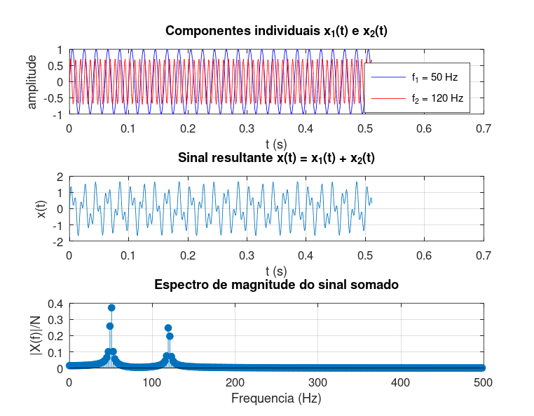

# Atividade 2 — Duas Senoides Coexistindo

**Pergunta investigada:** se somarmos duas senoides de frequências e amplitudes distintas, o espectro consegue separá-las? E recuperar as amplitudes originais?

---

## Setup do experimento

- *x₁(t) = 1,0·sin(2π·50·t)* → componente "dominante" em 50 Hz
- *x₂(t) = 0,7·sin(2π·120·t)* → componente secundária em 120 Hz
- *x(t) = x₁(t) + x₂(t)*
- Taxa de amostragem *Fs = 1000 Hz*; *N = 512*; *Δf = Fs/N ≈ 1,953 Hz*

Como *Δf* é bem menor que a separação entre 50 e 120 Hz, **espera-se distinção fácil** das duas componentes no espectro.

## Roteiro do código

Script: [`atividade_2.m`](../Simulacoes/Octave/atividade_2.m). O script chama uma rotina auxiliar `findpeaks_simple` (arquivo separado em `Simulacoes/Octave/`) — implementação compatível com Octave puro, sem depender do *Signal Processing Toolbox*.

## Saída da simulação



Picos detectados automaticamente pelo script:

| Componente | *f* esperada | *f* detectada | |X|/N medido | *A/2* esperado |
|---|---|---|---|---|
| x₁ | 50 Hz | **50,78 Hz** | **0,372** | 0,500 |
| x₂ | 120 Hz | **119,14 Hz** | **0,248** | 0,350 |

## O que o espectro revela

Os dois picos aparecem **claramente separados** — confirmação direta da **linearidade da DFT**:

```
DFT{x₁ + x₂} = DFT{x₁} + DFT{x₂}
```

No tempo, o sinal somado parece um padrão de batimento difícil de interpretar. No espectro, a "confusão" desaparece: cada senoide ocupa sua posição.

Por outro lado, as **magnitudes ficaram abaixo do esperado**: ≈ 74 % e ≈ 71 % do *A/2* teórico. A culpa é do mesmo vazamento que apareceu na Atividade 1 — nem 50 Hz nem 120 Hz caem exatamente em bins (*50/1,953 ≈ 25,6*; *120/1,953 ≈ 61,4*).

Detalhe interessante: a **razão entre as amplitudes medidas** é *0,248 / 0,372 ≈ 0,67*, próxima da razão real *A₂/A₁ = 0,7*. Ou seja, o vazamento afeta os dois picos de forma quase proporcional, preservando a proporção relativa.

## Lição prática

Para diagnóstico (saber *quanta* energia cada componente carrega), as magnitudes brutas da FFT podem ser imprecisas. Mas para **comparação relativa** entre componentes — mais alta? mais baixa? — a FFT é confiável mesmo com vazamento.
