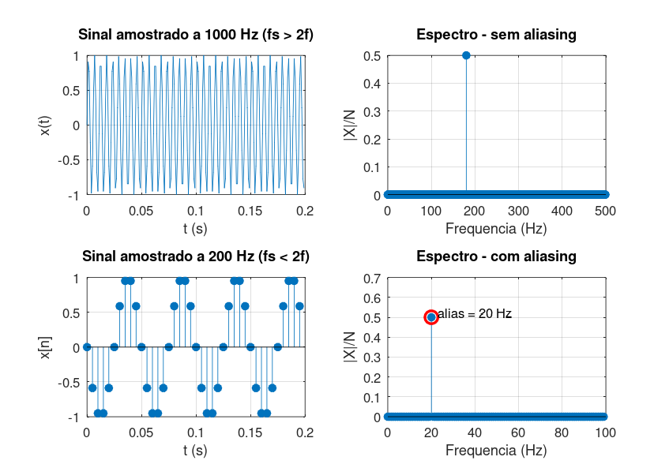

# Atividade 3 — Aliasing por Subamostragem

## Enunciado

Considere um sinal senoidal com frequência elevada e reduza a taxa de amostragem utilizada em sua geração. Compare os espectros obtidos antes e depois da redução da taxa de amostragem. Explique o fenômeno de aliasing observado.

---

## 1. Configuração do Experimento

Senoide de **180 Hz**, amostrada de duas formas diferentes:

| Caso | *Fs* | *Fs/2* (Nyquist) | Condição |
|---|---|---|---|
| A — adequada | 1000 Hz | 500 Hz | *Fs > 2·f* ✓ |
| B — insuficiente | 200 Hz  | 100 Hz | *Fs < 2·f* ✗ |

Pelo **Teorema da Amostragem (Nyquist–Shannon)**, para representar fielmente uma senoide de frequência *f*, a taxa de amostragem precisa satisfazer *Fs > 2f*. No caso B, essa condição é violada.

---

## 2. Implementação

Script: [`atividade_3.m`](../Simulacoes/Octave/atividade_3.m)

Frequência alias esperada quando *Fs < 2f*:

f_alias = |f − round(f/Fs)·Fs|

Para *f = 180 Hz* e *Fs = 200 Hz*:  *f_alias = |180 − 200| = 20 Hz*.

---

## 3. Resultados

- **Caso A (Fs = 1000 Hz):** pico em 180 Hz, exatamente onde deveria estar.
- **Caso B (Fs = 200 Hz):** o pico aparece em **20 Hz**, *disfarçado* como uma componente de baixa frequência.

---

## 4. Discussão

O aliasing é um **erro irrecuperável**: uma vez amostrado mal, o sinal não traz nenhuma marca que permita reconstruir a frequência original. Observando apenas o sinal digital do caso B, qualquer engenheiro concluiria que a senoide tem 20 Hz — quando, na realidade, ela tem 180 Hz.

A única forma de prevenir aliasing é instalar um **filtro anti-aliasing analógico** (passa-baixas) na entrada do conversor A/D, com frequência de corte abaixo de *Fs/2*. Isso é prática obrigatória em qualquer cadeia de aquisição profissional — desde osciloscópios digitais até placas de áudio e sistemas embarcados.

**Analogia clássica:** o efeito de rodas de carro que parecem girar para trás em filmes. A câmera amostra (em quadros por segundo) uma rotação cuja frequência excede a metade da taxa do filme; o cérebro interpreta o movimento como uma rotação mais lenta — um alias visual.
