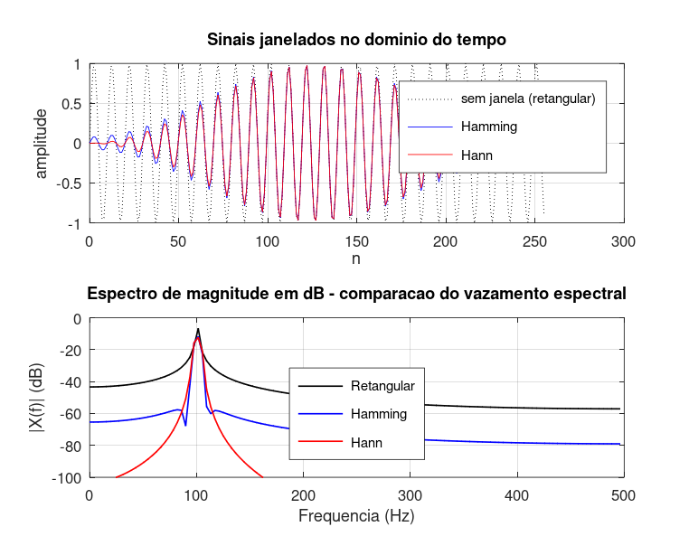

# Atividade 4 — Janelamento: Resolução vs. Vazamento

**Pergunta investigada:** quando aplicamos `fft` em um trecho finito de sinal, o que muda se multiplicarmos esse trecho por uma janela suave (Hann/Hamming)?

---

## De onde vem o vazamento

A DFT trata o sinal como se ele fosse **periódico** com período igual à janela observada. Quando a senoide não completa um número inteiro de ciclos dentro da janela, surgem descontinuidades nas bordas. Multiplicar por uma janela retangular (= simplesmente truncar) equivale, no domínio da frequência, a uma convolução com uma função *sinc*. Resultado: a energia "escorre" para os bins vizinhos — é o **vazamento espectral**.

Para evidenciar o efeito, escolhi *f₀ = 100,7 Hz* propositadamente (com *Fs = 1000 Hz*, *N = 256*, dá *f₀·N/Fs = 25,78* — bem longe de um bin inteiro).

## Roteiro do código

Script: [`atividade_4.m`](../Simulacoes/Octave/atividade_4.m).

Três janelas comparadas:

| Janela | Fórmula |
|---|---|
| Retangular | *w[n] = 1* |
| Hamming | *w[n] = 0,54 − 0,46·cos(2π·n/(N−1))* |
| Hann | *w[n] = 0,5 − 0,5·cos(2π·n/(N−1))* |

O espectro é plotado em **dB** para enxergar os lóbulos laterais.

## Saída da simulação

Atenuação típica do primeiro lóbulo lateral:

| Janela | 1º lóbulo lateral | Largura do lóbulo principal |
|---|---|---|
| Retangular | ≈ −13 dB | mais estreito |
| Hann | ≈ −32 dB | intermediário |
| Hamming | ≈ −43 dB | intermediário |

## O que o espectro revela

A senoide única gera, sem janela, **lóbulos laterais espalhados por toda a banda** em torno de −13 dB. Se houvesse uma segunda senoide próxima, mais fraca que 20 dB abaixo da principal, ela ficaria escondida atrás desses lóbulos.

Aplicando Hann ou Hamming, os lóbulos colapsam dezenas de dB. O preço pago é um **lóbulo principal um pouco mais largo** — ou seja, uma leve perda de resolução em frequência.

## Lição prática

Janelamento é um **trade-off entre resolução e contraste**:

- Janela retangular → lóbulo principal estreito (boa resolução), lóbulos laterais altos (vazamento ruim);
- Janelas suaves (Hann, Hamming, Blackman) → lóbulo principal mais largo, lóbulos laterais baixíssimos.

Em análise espectral profissional (vibração, áudio, telecom), janela retangular **quase nunca** é usada. Hann e Hamming são os padrões. Para situações específicas existem janelas mais sofisticadas: **Blackman-Harris** (lóbulos ainda mais baixos), **flat-top** (precisão de amplitude), **Kaiser** (lóbulos ajustáveis via parâmetro β).
