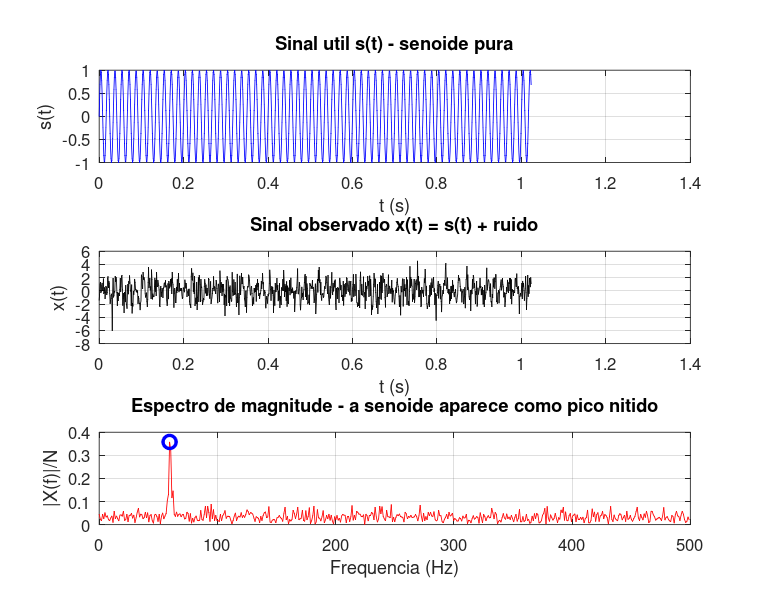

# Atividade 5 — Achando uma Senoide em Meio ao Caos

**Pergunta investigada:** quando o ruído tem mais potência que o sinal útil, é possível identificar a senoide enterrada? Como?

---

## Setup do experimento

- Sinal útil: *s(t) = 1,0·sin(2π·60·t)* em 60 Hz
- Ruído: *r(t) ~ N(0, σ²)* gaussiano branco, *σ = 1,2*
- Sinal observado: *x(t) = s(t) + r(t)*
- *Fs = 1000 Hz*, *N = 1024*

A relação sinal-ruído no tempo:

```
SNR_dB = 10·log₁₀( (A²/2) / σ² )
       = 10·log₁₀( 0,5 / 1,44 )
       = −4,59 dB
```

**O ruído tem mais energia que a senoide.** No tempo, o sinal parece ruído puro.

## Roteiro do código

Script: [`atividade_5.m`](../Simulacoes/Octave/atividade_5.m).

## Saída da simulação



Saída do console:

```
SNR aproximado do sinal: -4.59 dB
Frequencia dominante detectada na FFT: 59.57 Hz (esperado 60.0)
```

| Métrica | Valor |
|---|---|
| SNR no tempo | −4,59 dB |
| *f* esperada | 60 Hz |
| *f* detectada | 59,57 Hz (bin 61) |
| Δf = Fs/N | 0,977 Hz |
| Erro de localização | ≈ ½ bin |

## O que o espectro revela

O gráfico no tempo é uma "manchinha caótica" — sem o domínio espectral, ninguém adivinharia que existe uma senoide ali. Já no espectro: **pico inconfundível em ≈ 60 Hz**.

O leve desvio (59,57 vs 60 Hz) corresponde a meio bin — limitação inerente da resolução *Δf*, não do ruído.

## Por que funciona — o "ganho de processamento"

A explicação cabe em uma frase: **a energia da senoide concentra-se em um único bin; a energia do ruído branco se espalha por todos os *N/2* bins.**

Numericamente:

- Energia da senoide no seu bin: proporcional a *A²/2*;
- Energia do ruído em **um** bin: proporcional a *σ²/(N/2)*.

Logo, a relação sinal-ruído **dentro de um bin** é:

```
SNR_freq ≈ (A²/2) / (σ²/(N/2)) = SNR_tempo · (N/2)
```

Para *N = 1024*, isso é um **ganho de 512×**. Em dB:

```
SNR_freq_dB = SNR_tempo_dB + 10·log₁₀(N/2)
            = −4,59 + 10·log₁₀(512)
            ≈ −4,59 + 27,1 = 22,5 dB
```

Por isso o pico aparece dezenas de dB acima do piso de ruído — mesmo com SNR negativo no tempo.

## Lição prática

Esse é o princípio operacional de praticamente toda a engenharia de **detecção**:

- **Radar/sonar:** detectar ecos fracos enterrados em ruído de fundo;
- **Comunicações digitais:** receber portadoras enterradas no ruído térmico;
- **Diagnóstico de vibração:** identificar falhas incipientes antes que apareçam no tempo.

A FFT funciona como **filtro casado distribuído** — cada bin atua como um filtro estreito centrado em sua frequência. Quanto mais amostras (maior *N*), mais estreitos os filtros, melhor a detecção.
