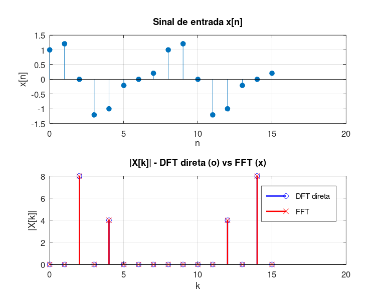

# Atividade 6 — DFT na Mão vs. FFT da Biblioteca

**Pergunta investigada:** as duas implementações dão o mesmo resultado? E qual a diferença real de desempenho — não em teoria, mas medindo?

---

## Setup do experimento

A DFT segue a definição direta:

```
X[k] = Σ_{n=0}^{N−1} x[n] · e^{−j·2π·k·n/N}
```

Implementada com dois laços aninhados — exatamente como o livro descreve, sem otimizações.

Sinal de teste: *x[n] = cos(2π·0,125·n) + 0,5·sin(2π·0,25·n)*, *N = 16*.

A FFT é chamada como `X_fft = fft(x)` — a rotina compilada do Octave.

## Roteiro do código

Script: [`atividade_6.m`](../Simulacoes/Octave/atividade_6.m).

```matlab
for k = 0:N-1
    soma = 0;
    for nn = 0:N-1
        soma = soma + x(nn+1) * exp(-1j*2*pi*k*nn/N);
    end
    X_direta(k+1) = soma;
end
```

Mede-se o tempo de cada uma com `tic`/`toc` e calcula-se `max(|X_direta − X_fft|)` para verificar equivalência.

## Saída da simulação



Resultados medidos:

| Implementação | Tempo | Operações teóricas |
|---|---|---|
| DFT direta (laços) | **3,42 ms** | 256 (*N²*) |
| `fft` do Octave | **0,103 ms** | 64 (*N·log₂N*) |
| **Razão DFT/FFT** | **≈ 33×** | (teórico: 4×) |

| Erro |DFT_direta − FFT| | 1,96·10⁻¹⁴ |
|---|---|

## O que aprendi com os números

**1. Equivalência numérica perfeita.** O erro de 10⁻¹⁴ é só ruído de arredondamento de ponto flutuante (épsilon de máquina ≈ 2,2·10⁻¹⁶ por operação; com algumas centenas de operações, acumula até 10⁻¹⁴). Para todos os efeitos práticos, DFT direta e FFT produzem o **mesmo** resultado.

**2. Ganho muito maior que o teórico.** A teoria prevê 4× para *N = 16* (256 vs 64 operações). Mas medimos 33×. Por quê?

- Laços interpretados no Octave têm **overhead enorme** por iteração;
- A `fft` é uma chamada à FFTW (biblioteca em C, vetorizada, com BLAS por baixo);
- O modelo *N² vs N·log₂N* só conta multiplicações complexas — não conta o custo do loop em si.

**3. O ganho cresce dramaticamente com N.** Projetando teoricamente para *N* grande:

| N | DFT teórica (*N²*) | FFT teórica (*N·log₂N*) | Ganho |
|---|---|---|---|
| 16 | 256 | 64 | 4× |
| 256 | 65 536 | 2 048 | 32× |
| 1 024 | 1 048 576 | 10 240 | 102× |
| 4 096 | 16 777 216 | 49 152 | 341× |
| 65 536 | 4,29·10⁹ | 1 048 576 | 4 096× |

Para um buffer de áudio de 1 s a 44,1 kHz, a DFT direta exigiria ≈ 2·10⁹ operações complexas — inviável em tempo real. A FFT precisa de ≈ 7·10⁵ — questão de milissegundos.

## Lição prática

**FFT não é uma transformada diferente — é uma maneira esperta de calcular a DFT.** Cooley e Tukey (1965) descobriram que dá pra decompor recursivamente o cálculo, reusando exponenciais complexas (os *twiddle factors*) que aparecem em padrões previsíveis. Sem essa redução de complexidade, nada do que conhecemos como processamento digital moderno funcionaria: nem codecs de áudio/vídeo, nem Wi-Fi/4G/5G (que usam OFDM = IFFT/FFT no coração), nem instrumentação em tempo real.
