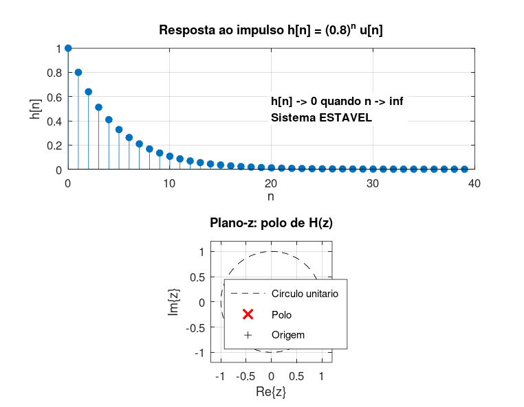

# Atividade 7 — Função de Transferência, Resposta ao Impulso e Estabilidade

## Enunciado

Considere a função de transferência discreta:

H(z) = 1 / (1 − 0,8·z⁻¹)

Determine numericamente sua resposta ao impulso e represente-a graficamente. A partir do comportamento da sequência, discuta se o sistema é estável.

---

## 1. Análise Teórica

A equação de diferenças correspondente é:

y[n] = x[n] + 0,8·y[n−1]

Aplicando um impulso *x[n] = δ[n]*, a resposta ao impulso é:

h[n] = (0,8)ⁿ · u[n]

— uma sequência geométrica decrescente. O **único polo** está em *z = 0,8*, situado **dentro do círculo unitário** do plano-*z*.

---

## 2. Implementação

Script: [`atividade_7.m`](../Simulacoes/Octave/atividade_7.m)

```matlab
B = 1;  A = [1 -0.8];
delta = [1 zeros(1, N-1)];
h     = filter(B, A, delta);     % resposta ao impulso numerica
polos = roots(A);                % polo em z = 0.8
```

A comparação entre *h[n]* numérica (saída de `filter`) e a expressão analítica *(0,8)ⁿ* dá erro máximo de **5,55·10⁻¹⁷** — equivalente à precisão de máquina (épsilon do `double`).

---

## 3. Resultados



- *h[n]* decai geometricamente para zero;
- O polo *z = 0,8* aparece estritamente dentro do círculo unitário.

---

## 4. Discussão

### Critério de Estabilidade BIBO

Um sistema LTI discreto é **estável BIBO** (*bounded-input, bounded-output*) se e somente se sua resposta ao impulso é **absolutamente somável**:

Σ |h[n]| < ∞

Para *h[n] = αⁿ·u[n]*, a soma converge se e somente se |α| < 1. Equivalentemente, no domínio-*z*, isso significa que **todos os polos de H(z) estão dentro do círculo unitário**.

### Por que essa condição?

Quando |α| ≥ 1, a resposta ao impulso cresce indefinidamente, e qualquer perturbação finita produz saída ilimitada. Quando |α| → 1, o sistema fica "marginal" — uma componente em frequência igual ao polo produz ressonância infinita. Quando |α| < 1, o sistema dissipa naturalmente toda perturbação, retornando ao repouso.

### Paralelo com sistemas contínuos

| Domínio | Plano | Região estável |
|---|---|---|
| Contínuo (Laplace) | *s* | Re{s} < 0 (semi-plano esquerdo) |
| Discreto (Transformada-Z) | *z* | \|z\| < 1 (dentro do círculo unitário) |

A função exponencial *z = e^{sT}* mapeia o eixo imaginário do plano-*s* exatamente no círculo unitário do plano-*z*. O critério é o mesmo — apenas a forma muda.

### Conclusão

O sistema em questão é **estável**. Seu único polo (*z = 0,8*) está dentro do círculo unitário, e a resposta ao impulso decai exponencialmente. Este é o protótipo de um **filtro IIR passa-baixas de primeira ordem**, base para muitas aplicações de filtragem digital simples e eficiente.
