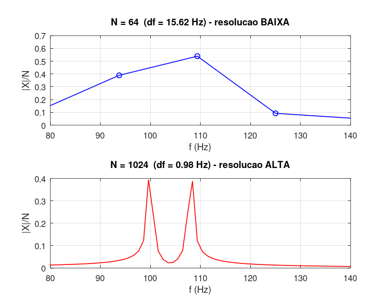

# Atividade 8 — Resolução Espectral e Tempo de Observação

## Enunciado

Considere dois sinais com durações diferentes, mas com a mesma frequência fundamental. Calcule a FFT de ambos e compare a resolução espectral obtida. Explique a influência do número de amostras na análise em frequência.

---

## 1. Resolução Espectral

A resolução em frequência da DFT é dada por:

Δf = Fs / N = 1 / (N·Ts) = 1 / T_obs

onde *T_obs* é o **tempo total de observação** do sinal. Duas componentes só podem ser separadas no espectro se sua distância em frequência for **maior** que Δf.

---

## 2. Experimento

Duas senoides muito próximas: *f₁ = 100 Hz* e *f₂ = 108 Hz* (separação de 8 Hz). *Fs = 1000 Hz*.

| Caso | *N* | *T_obs* | Δf | Distinguíveis? |
|---|---|---|---|---|
| A — pouca observação | 64   | 64 ms   | 15,6 Hz | ✗ (Δf > 8 Hz) |
| B — muita observação | 1024 | 1,024 s | 0,98 Hz | ✓ (Δf < 8 Hz) |

---

## 3. Implementação

Script: [`atividade_8.m`](../Simulacoes/Octave/atividade_8.m)

---

## 4. Resultados

- **Caso A (N = 64):** os dois picos se fundem em um único "borrão" — a DFT é incapaz de separá-los.
- **Caso B (N = 1024):** os dois picos aparecem **perfeitamente separados** em 100 Hz e 108 Hz.

---

## 5. Discussão

### Compromisso tempo × frequência

Aumentar *N* aumentando o tempo de observação melhora a resolução em frequência, mas:

- Exige sinal **estacionário** durante todo *T_obs* — se o sinal mudar, a FFT "borra" as variações;
- Aumenta o custo computacional;
- Reduz a "resolução no tempo" (sabe-se *que* a frequência está presente, mas não exatamente *quando*).

Este é o **princípio da incerteza tempo-frequência**: Δt · Δf ≥ constante. Para sinais não-estacionários, a solução é a STFT (FFT em janelas curtas deslizantes) ou wavelets.

### Aumentar *Fs* ajuda?

Não! Aumentar *Fs* mantendo *N* constante **piora** Δf (Δf = Fs/N cresce). O que melhora a resolução é aumentar *T_obs = N/Fs*, ou seja, **observar o sinal por mais tempo**.

**Zero-padding** (adicionar zeros ao sinal antes da FFT) faz com que o gráfico do espectro fique mais "denso" em pontos, mas **não melhora a resolução real** — apenas interpola entre os bins. A resolução continua governada pelo *T_obs* original.

### Resumo prático

Para separar duas componentes em frequência distantes *Δf₀*, observe o sinal por pelo menos:

*T_obs ≥ 1 / Δf₀*

— independente da taxa de amostragem.
