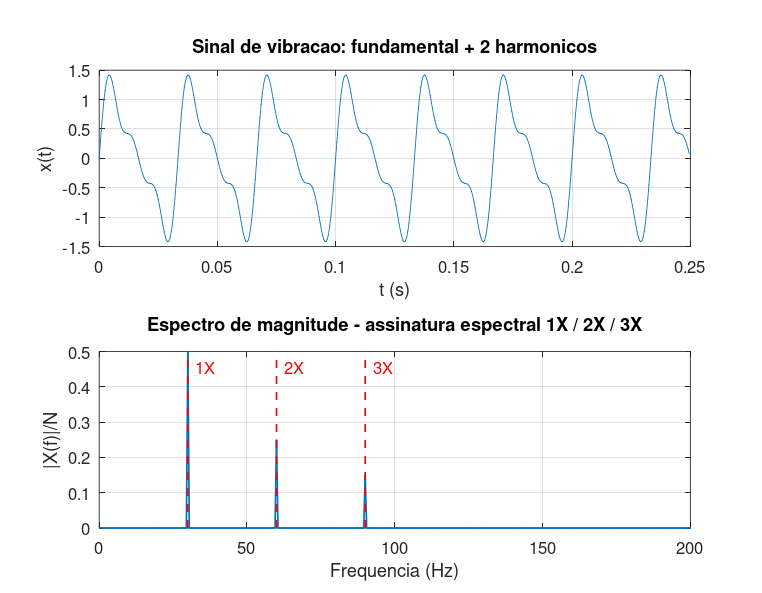

# Atividade 9 — Fundamental + Harmônicos: A Assinatura Mecânica

**Pergunta investigada:** quando um sinal contém uma frequência principal e seus múltiplos inteiros (harmônicos), o que o espectro mostra? E como engenheiros usam isso na manutenção industrial?

---

## Contexto físico

Um eixo girando a **1800 RPM** corresponde a *f₁ = 30 Hz*. Em terminologia industrial, essa é a componente "**1×**" (uma vez a frequência de rotação). Harmônicos superiores aparecem por:

- **2× (60 Hz):** desalinhamento ou eixo empenado
- **3× (90 Hz):** folgas mecânicas, falhas em engrenagens

## Setup do experimento

Sinal sintetizado com três componentes:

```
x(t) = 1,0 · sin(2π · 30 · t)   ← 1× (fundamental)
     + 0,5 · sin(2π · 60 · t)   ← 2×
     + 0,3 · sin(2π · 90 · t)   ← 3×
```

Parâmetros: *Fs = 2000 Hz*, *T = 2 s* (*N = 4000*). Resolução Δf = 0,5 Hz — folgada.

## Roteiro do código

Script: [`atividade_9.m`](../Simulacoes/Octave/atividade_9.m).

## Saída da simulação



Picos detectados:

| Componente | Frequência detectada | |X|/N medido | Amplitude original |
|---|---|---|---|
| 1× | 30,0 Hz | **0,500** | 1,0 |
| 2× | 60,0 Hz | **0,250** | 0,5 |
| 3× | 90,0 Hz | **0,150** | 0,3 |

Note: como as frequências caem **exatamente em bins inteiros** (*30/0,5 = 60*, *60/0,5 = 120*, *90/0,5 = 180*), não há vazamento — as magnitudes medidas batem **exatamente** com *A/2*.

## A leitura espectral como diagnóstico

A FFT funciona como **assinatura digital** de uma máquina. Cada falha mecânica deixa um padrão característico:

| Padrão no espectro | Falha provável |
|---|---|
| 1× muito alto | Desbalanceamento de massa |
| 2× dominante | Desalinhamento de eixo, eixo empenado |
| 3× e harmônicos altos | Folgas mecânicas, mancais soltos |
| Bandas laterais em torno de harmônicos | Defeitos em rolamentos (BPFO, BPFI, BSF) |
| Picos em múltiplos da frequência de engrenamento | Falhas em engrenagens (dente quebrado etc.) |

A indústria normalizou essa análise nas séries **ISO 10816** (avaliação de vibração em máquinas) e **ISO 13373** (monitoramento de condição).

## Por que harmônicos surgem?

Em primeira aproximação, sistemas mecânicos são lineares — uma rotação senoidal produziria uma única componente espectral. **Mas a presença de não-linearidades** (folgas, batimentos, impactos) introduz componentes em múltiplos inteiros da fundamental. Quanto mais "feia" a não-linearidade, mais harmônicos.

Outro mecanismo: rotação periódica não-senoidal. Pense em uma roda dentada girando: o pulso elétrico que cada dente gera ao passar pelo sensor é uma onda quadrada de frequência *N·f_rot* (*N* = número de dentes). Pela série de Fourier, essa onda quadrada se decompõe em uma série de harmônicos.

## Lição prática

A FFT, sozinha, transforma vibração crua em **diagnóstico interpretável**. Um técnico de manutenção preditiva olha o espectro e diz: "*isto aqui é um desalinhamento, aquilo lá é um rolamento começando a falhar*" — antes mesmo de a falha se manifestar em pane ou quebra.

**Limitação importante:** vibrações de **impacto** (choques localizados, defeitos pontuais de rolamento) geram sinais transitórios mal representados pela FFT clássica. Para isso existem técnicas complementares:

- **Análise de envelope** (Hilbert): expõe frequências moduladoras
- **Cepstrum:** detecta periodicidades nos próprios harmônicos
- **Wavelet:** localiza eventos no tempo + frequência simultaneamente

Mesmo assim, a FFT continua sendo a **primeira ferramenta** aplicada — e, na maioria dos casos, suficiente.
