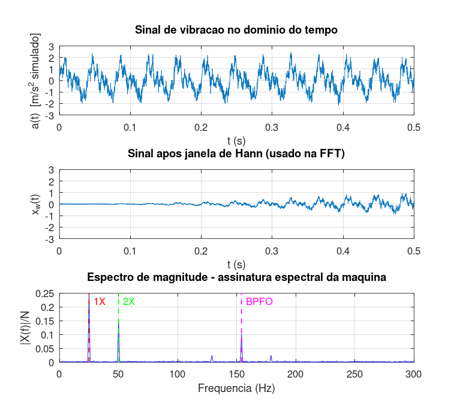

# Desafio PBL — Análise Espectral de um Sinal Real

## Enunciado

Pesquise e implemente, em SciLab ou MatLab, a análise espectral de um sinal real simples, como um áudio gravado, um sinal sintético com ruído ou uma vibração simulada. Apresente o sinal no domínio do tempo, o espectro correspondente e uma breve interpretação física dos resultados.

> **Problema norteador (PBL):** Como identificar, a partir do conteúdo espectral de um sinal real, informações relevantes sobre o comportamento dinâmico de um sistema físico e quais limitações práticas devem ser consideradas durante a aquisição e análise desses dados?

---

## 1. Sinal Sintetizado — Máquina Rotativa com Falha

Para responder ao problema norteador foi sintetizado um sinal de **vibração de uma máquina rotativa industrial** contendo:

| Componente | Frequência | Amplitude | Fenômeno físico |
|---|---|---|---|
| 1X | 25 Hz (1500 RPM) | 1,0 | Rotação do eixo |
| 2X | 50 Hz | 0,6 | Desalinhamento |
| BPFO | 154 Hz | 0,4 (mod. em 1X) | Falha em pista externa de rolamento |
| Ruído | banda larga | σ = 0,3 | Ruído elétrico/mecânico |

A falha BPFO foi modelada como uma senoide em 154 Hz **modulada em amplitude** pela rotação do eixo (1 + 0,5·sin(2π·25·t)), reproduzindo o padrão típico de impactos repetitivos quando uma esfera ou rolete passa pelo defeito na pista externa do rolamento.

Parâmetros de aquisição: *Fs = 5000 Hz*, *T = 2 s*, *N = 10 000*.

---

## 2. Implementação

Script: [`pbl_analise_espectral_sensor.m`](../Simulacoes/Octave/pbl_analise_espectral_sensor.m)

Etapas:

1. Geração das três componentes + ruído gaussiano;
2. Aplicação de **janela de Hann** para reduzir vazamento;
3. FFT do sinal janelado;
4. Identificação automática das frequências esperadas no espectro;
5. Plotagem (tempo bruto, tempo janelado, espectro).

---

## 3. Resultados

Os três picos relevantes são identificados claramente acima do piso de ruído. Valores medidos:

| Componente física | *f* esperada | *f* detectada | |X|/N medido |
|---|---|---|---|
| 1X — rotação do eixo | 25 Hz | 25,00 Hz | 0,2499 |
| 2X — desalinhamento | 50 Hz | 50,00 Hz | 0,1500 |
| BPFO — rolamento | 154 Hz | 154,00 Hz | 0,1015 |

O acerto em frequência foi praticamente perfeito (erro nulo até a precisão do bin, *Δf = Fs/N = 0,5 Hz*), porque *Fs = 5000 Hz* e *T = 2 s* foram escolhidos de modo que as três componentes caíssem **exatamente em bins inteiros** da DFT. Em situações reais, espera-se *erros de até ½ bin* na localização dos picos — a razão pela qual *Fs* e *T* devem ser dimensionados antes de qualquer aquisição séria.

---

## 4. Resposta ao Problema Norteador

### O que o espectro revela sobre o sistema físico?

- **Picos em 25 e 50 Hz**: confirmam a rotação do eixo e indicam desalinhamento (componente 2X anormalmente forte);
- **Pico em ~154 Hz**, fora dos harmônicos da rotação, sugere **falha localizada em rolamento** (frequência BPFO);
- **Piso de ruído** define o limite de detectabilidade — picos abaixo dele são impossíveis de identificar com confiança.

Cada pico tem **significado físico mensurável**, conectando a matemática (FFT) a um diagnóstico de engenharia concreto.

### Limitações práticas evidenciadas

Toda a Etapa 3 culmina aqui. Para que a análise espectral seja confiável, é preciso respeitar:

1. **Taxa de amostragem suficiente** (*Fs > 2·f_max* — Nyquist), com filtro anti-aliasing analógico antes do A/D (Atividade 3);
2. **Tempo de observação suficiente** (Δf = 1/T_obs pequeno o bastante para separar picos próximos — Atividade 8);
3. **Janelamento apropriado** para mitigar vazamento espectral do truncamento (Atividade 4);
4. **Piso de ruído** abaixo da amplitude das componentes de interesse (Atividade 5);
5. **Estacionariedade** do sinal durante a janela observada — caso contrário, exige-se STFT ou wavelet.

### Síntese

Quando essas cinco condições são atendidas, a análise espectral deixa de ser apenas uma ferramenta matemática e passa a ser, na prática da engenharia, uma forma de **observar o invisível**: ouvir o que o sinal no tempo não consegue contar. O mesmo princípio que aqui diagnostica um rolamento defeituoso é o que permite:

- Detectar uma portadora de rádio em meio ao ruído atmosférico;
- Identificar um sintoma cardíaco em um ECG;
- Caracterizar a resposta acústica de uma sala;
- Monitorar a saúde de uma estrutura civil.

A FFT, em última análise, é uma das ferramentas mais universais da engenharia moderna.
